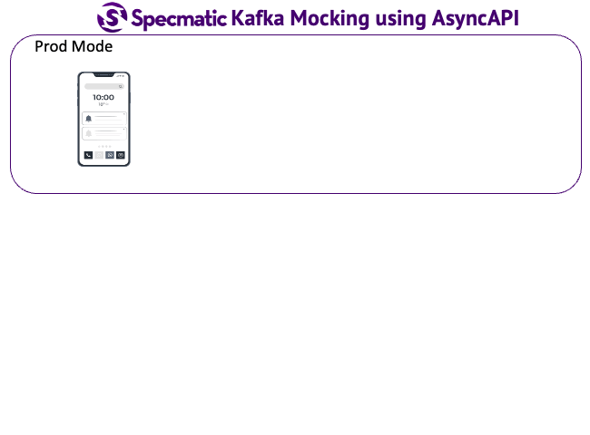

# Specmatic Sample: GO BFF calling Domain API

* [Specmatic Website](https://specmatic.io)
* [Specmatic Documenation](https://specmatic.io/documentation.html)

This sample project demonstrates how we can practice contract-driven development and contract testing in a GO application that depends on an external domain service and Kafka. Here, Specmatic is used to stub calls to domain API service based on its OpenAPI spec and mock Kafka based on its AsyncAPI spec.

Here is the domain api [contract/open api spec](https://github.com/znsio/specmatic-order-contracts/blob/main/io/specmatic/examples/store/openapi/api_order_v3.yaml)

Here is the [AsyncAPI spec](https://github.com/znsio/specmatic-order-contracts/blob/main/io/specmatic/examples/store/asyncapi/kafka.yaml) of Kafka that defines the topics and message schema.

## Definitions
* BFF: Backend for Front End
* Domain API: API managing the domain model
* Specmatic Stub/Mock Server: Create a server that can act as a real service using its OpenAPI or AsyncAPI spec

## Background
A typical web application might look like this. We can use Specmatic to practice contract-driven development and test all the components mentioned below. In this sample project, we look at how to do this for GO BFF which is dependent on Domain API Service and Kafka demonstrating both OpenAPI and AsyncAPI support in specmatic.



## Tech
1. Go (Gin)

## Contract testing (Run Tests)
### Using test containers (preferred)
```shell
go mod tidy
go test contract_test.go -v -count=1
```
 